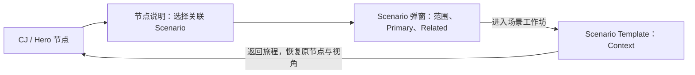

# Scenario ↔ Source steps 映射与弹窗到 Template 的交互分析

日期：2026-09-09。主线：`codex/xiaoming-main-flow-20260909`。

状态更新：用户随后要求先实施 map、暂不修改 Scenario Template。映射目录与弹窗现已接入，见 [实施记录](implementation-20260909.md)。下文保留实施前的分析；Template 路由与九模块内容仍是后续建议，不代表已实现。

## 1. 采用的纲领与数据层级

本次用户明确指定 [Scenario Template ↔ Source Process Mapping](Clear_to_Trade_Scenario_to_Source_Process_Mapping_for_Codex.md) 为后续映射纲领。其业务映射与模板结构用于本次分析；文档中的执行措辞不自动授权发布、外部操作或其他附加任务。

四层对象必须分清：

| 层级 | 当前数量 | 用途 |
| --- | ---: | --- |
| 旅程画布节点 | CJ 查找器显示 31 | 总览位置与进入场景的入口；一个节点可以关联多个 Scenario |
| Scenario | 15 | 用户工作的容器，保留稳定 `SCN-*` ID；显示编号 S1–S15 依据本纲领 |
| 来源动作 M/C | 71 个不同编号 | 支撑 Before / To-be 的来源锚点；Primary 共 73 次关联，因为 M3.5 跨 S4/S5/S6 |
| 既有分析工作 / 原子动作 | 94 / 229 | 既有设计拆解与讨论素材，不等同于 71 个来源动作，也不直接成为 94/229 个 Template |

逐场景检查 `content.mjs` 中既有工作项的 `qualified_process_refs`：15 个 Scenario 的 Primary 编号均已有锚点，未发现落在该场景新 Primary/Related 集合以外的既有编号。这说明已有追溯可以复用；它并不证明每项工作内容、步骤顺序、Current/Target 对应关系都已满足新纲领。

完整结果：[映射 JSON](scenario-source-mapping.json)；[逐来源动作 CSV](scenario-source-steps.csv)。CSV 中标题与泳道来自现有 `node_dictionary.csv`，并非本次重新转录 PPT。JSON 保留既有 occurrence locator；未把相同 M/C 编号的不同来源实例合并掉。

## 2. 当前用户点击后实际发生什么

2026-09-09 在 8899 端口英文 CJ 页面验证了 Booking context → Establish the relationship：

1. 点击画布节点，出现画布内的 **Semantic Passport**（`#focus-chip`），展示节点名、类型、上下游关系，以及 **Open detailed workflow** 场景按钮。
2. 点击 **Establish the relationship →**，父页面打开 `#sn-panel` Scenario 弹窗，地址增加 `scenario=SCN-SCOPE`。
3. 弹窗展示标题、案例情境、人物、SCOPE 特有的 M0–M1 提示、Before/After 图、Part 切换及工作项列表。工作项展开后，在 **Sources** 下才能看到详细 M/C 来源。
4. 尚无 **Open Scenario Template** 入口；现有 **Demo** 导航指向 `08_inspire/app/`，用途不同。

证据位置：

- `prototype/studio-next/target-journey.html:15174` 附近：节点到 SCN 的映射、场景按钮与 `postMessage`。
- `prototype/studio-next/hero-journey.html:14467` 附近：Hero 入口维护另一份类似映射。
- `prototype/studio-next/ui.mjs:49`：Scenario 弹窗正文。
- `prototype/studio-next/ui.mjs:46`：工作项 Sources 及详细来源。
- `prototype/studio-next/ui.mjs:54`：父页面弹窗容器与标题栏。
- `prototype/studio-next/ui.mjs:105`：接收画布选择事件。

当前存在的是“节点说明 → Scenario 详情”两层。新增映射和 Template 按钮应进入现有 Scenario 弹窗，避免再叠第三层弹窗。

## 3. Scenario 弹窗中，映射内容出现在哪里

推荐顺序如下：

| 位置 | 默认展示 | 用户下一步 |
| --- | --- | --- |
| 顶部标题 | `S1 · Define onboarding scope`，旅程阶段与一句目标；保留案例、人物背景 | 确认自己进入的业务场景 |
| 标题与人物之后、流程图之前 | **Source process mapping / 来源流程映射** | 第一屏就理解场景覆盖范围 |
| 映射区第一组 | **Primary · 主干来源**：M/C 标签与简短动作名；超长列表可展开 | 点击标签在同一弹窗内展开来源说明 |
| 映射区第二组 | **Related · 关联来源**：标注输入、依赖、复用、反馈或下游使用的关系 | 查看为何关联；不得自动追加到串行流程尾部 |
| 映射区末尾 | 一句边界说明；必要时明确“来源内容 / 设计细化 / 待验证” | 区分原始动作与后续设计 |
| 后续内容 | 既有流程预览与工作项作为可展开的详细参考；推荐打开弹窗时先看 Before，After 明示为目标提议 | 快速预览，不在此完成整个工作坊 |
| 固定操作区 | **进入场景工作坊 / Open Scenario Template →**；次要操作为返回旅程 | 明确进入完整分析流程 |

M/C 标签的展开内容建议包括：动作名称、来源版本、页/shape/泳道/occurrence、此处属于 Primary 还是 Related、相关既有工作项。编号相同但实例不同的来源必须分别显示；不能只拿动作文本当唯一键。标签本身只展开来源，不打开独立 M/C 页面。

主按钮旁的辅助文案：**“从案例背景开始，沿现状流程讨论问题、改造与人工决策。”** 不使用“批准”“完成”等会混淆导航与业务状态的表述。

### S1 示例

```text
S1 · Define onboarding scope
建立本次机构入驻的范围与业务上下文

Primary · 主干来源
M0.1  M0.2  M0.3  M0.4  M1.1  M1.2  M1.3

Related · 关联来源
M2.4 — 风险 / EDD 要求变化反馈到 scope

提示：M0.1 的详细分支属于 S1 内部；Target 的两个 M0.1 来源实例分别保留。

[查看流程预览]                    [进入场景工作坊 →]
```

上面是来源清单，不表示这些动作必须按编号顺序执行。S1 的 Before 仍须依据来源连接与可验证的业务逻辑组织；M0.1 详细调查是其中一段，而非整个 S1。

## 4. 从弹窗引导进入 Scenario Template



推荐同一标签页进入完整 Template，给流程画布和讨论足够空间。相比把九段工作坊塞进弹窗，同页完整工作区更适合长流程和讨论；另开标签页可以作为浏览器普通链接行为保留，但不作为默认操作。

建议的新入口为 `prototype/scenario-template/index.html`，通过稳定 `scenario=SCN-SCOPE`、`section=context`、`locale=en-US` 加载内容。该路径尚未创建。S1–S15 是展示编号，不用数组下标决定场景，尤其不能把当前排列第 11 个 Legal 错接成纲领的 S11 Credit。

进入时携带：SCN ID、语言、CJ/Hero 视角、原节点、画布缩放/平移与回返位置。当前桥接消息只传 scene ID，因此原节点及 camera 的可靠回返仍需补充设计与验证，不能宣称现有实现已完整覆盖。

首次进入落在 Context；存在该场景草稿时，显示“继续上次讨论”及其章节，避免静默改变用户预期。返回只恢复导航，不修改业务决策。草稿按 `scenario + case + template schema version` 隔离，避免 15 个场景共用 M0.1 的存储键。语言切换不应创建第二份业务草稿。

## 5. 九段 Template 如何承接映射

| 模块 | 应展示什么 | 映射规则 |
| --- | --- | --- |
| Context | Hero Case、目标、人物、触发、预期结果、假设 | 弹窗概述进入完整场景背景；明确 Primary / Related 范围 |
| Before | Primary 驱动的完整现状图，含分支、等待、例外及交接 | 节点显示 M/C 标签；Related 作为必要的输入、依赖或复用连接 |
| Diagnose | 同一 Before 图上的 Pain / Opportunity / Comments / 验证状态 | 沿用 Before node ID，不另建断开的第二张问题图 |
| Transform | Retain / Remove / Optimize / Add 与具体对象、理由 | 每条处理连到当前节点和问题；已有 Enhance 词汇需归一展示并保留原文 |
| To-be | 场景级 Agent / Skill / Rule / Human 协作流程 | 新增节点注明设计来源；保留并行与回环；Human Gate 出现在图上 |
| Human Gate | 为什么停、Agent 已完成什么、谁决定、决定什么、从哪恢复 | 从 To-be 中的 gate 节点生成；不同决定不能一律演示成继续 |
| Summary | Current → Pain → Opportunity → Transformation → Target → Gate → Capability | 从讨论记录生成；尚未讨论与已确认内容分开 |
| Product Feature Bundle | 场景级产品能力组合 | 每项能力连接一个或多个场景发现；无依据的建议明确标识 |
| Demo | 当前 Scenario 对应的交互原型 / 视频 | 位于推理与总结之后；没有内容时明确标记待补充 |

### 现有 Kimi Template 的接入差距

分析参考目录：`../../../experiments/kimi-scenario-template-r01/app/`（相对本文件）。

现有实现是固定 M0.1 的六段导航：Context / Before / Diagnose / To-be / Human Gates / Summary；Feature Bundle 目前在 Summary 中。纲领定义的是九个模块，需要补齐或明确独立组织 Transform、Product Feature Bundle、Demo，保持既有可用交互和设计语言。

目前 `app/app.js` 使用固定 `ctt-m01-studio-v1` 存储键，页面标题与内容固定为 M0.1，末尾仍有 “Next scenario → M0.2”。没有按 SCN ID 加载 15 个场景的能力。仅追加 `?scenario=SCN-*` 不会自动切换内容。

因此应先把模板变成按 Scenario 读取内容的容器，再填充 S1 的完整七个 Primary 来源。M0.1 原有十步调查保留为 S1 的局部展开；末尾改为场景级返回或已实现的下一个 Scenario。其他场景只有完成对应内容后才提供真实工作坊入口；不能默认跳进 M0.1 或假装全部已完成。

## 6. 十五场景的稳定映射与重点

| Scenario | 稳定 ID | Primary | Related | 内容接入重点 |
| --- | --- | --- | --- | --- |
| S1 Define onboarding scope | SCN-SCOPE | M0.1–M0.4、M1.1–M1.3 | M2.4 | 完整 scope；M0.1 分支嵌在其中 |
| S2 Confirm entity & authority | SCN-ENTITY | M1.4、M1.5 | M1.3、M2.1、M3.3、M3.4 | 主体核实来自原流程；完整授权核实标记为设计细化 |
| S3 Determine applicable requirements | SCN-REQUIREMENTS | M2.1–M2.5 | M0.4、M3.3 | 适用性、减免、汇总、风险调整、发出要求 |
| S4 Reuse existing evidence | SCN-SOURCE | M3.1、M3.5 | M3.2、M3.4 | 复用目的、来源、时效；M3.5 不独占 |
| S5 Request & submit missing information | SCN-GAP | M3.2、M3.3、M3.5 | M2.5、M3.4 | 剩余缺口、请求、响应、未完状态；验证交接给 S6 |
| S6 Assess evidence for purpose | SCN-VALIDATE | M3.4、M3.5 | M3.3 | 区分已收、来源有效、目的可用、足够 |
| S7 Establish screening population | SCN-POPULATION | M4.1–M4.4 | M4.7 | 覆盖早期与全面筛查执行，不只建立名单 |
| S8 Review possible screening match | SCN-MATCH | M4.5–M4.7 | M3.3、M3.4、M8.1 | 人工判断；证据回环；就绪是下游使用 |
| S9 Conduct EDD | SCN-EDD | M5.1–M5.10 | M2.4 | 完整生命周期；Target 显式新增分解不证明 Current 无判断 |
| S10 Conduct conflicts review | SCN-CONFLICTS | M7.1–M7.7 | M1.1 | 可早启、并行；Current/Target 不存在的实例不能伪造 |
| S11 Assess Credit & conditions | SCN-CREDIT | C2.1–C2.7 | C1.4、C1.6 | 信贷决定、条件、履行与最终协议检查分开 |
| S12 Manage Legal agreements & conditions | SCN-LEGAL | C1.1–C1.8 | C2.6、C2.7 | 与信贷按具体依赖交接，不整体串行等待 |
| S13 QA review | SCN-QA | M6.1–M6.8 | — | 保留完整 QA、缺口、整改、复核和签核 |
| S14 Aggregate readiness conditions | SCN-READINESS | M8.1 | M6.1、M8.3 | Ready 与 authorised confirmation 分开 |
| S15 Confirm & publish outcome | SCN-PUBLISH | M8.2–M8.5 | — | 决定、记录、时间、发布、通知分开 |

## 7. 来源与跨场景的验收重点

- S11/S12 以稳定 SCN ID 映射，不按旧数组顺序赋号。
- M0.1 Target 两个实例保留页、shape、泳道及 occurrence；另一个重复风险是 Current M3.3 在 RM 与 KYC Ops 的实例，亦保留分别追溯。
- M3.3 在 S5 为 Primary，在 S2/S3/S6/S8 为复用来源，不复制成多条互相独立的请求生命周期。
- M3.5 可同时服务 S4/S5/S6，73 次 Primary 关联不表示有 73 个不同来源编号。
- S12 对 C2.7 的消费不产生第二次 Credit 决定。Legal / Credit 仅在具体节点等待。
- M5.9/M5.10，以及既有来源标明 Target-only 的 M7.5–M7.7，不能因 Primary 清单包含它们就伪造 Current 节点。
- S14 弹窗与 Template 不出现“已经发布准入”的结论；S15 导航、切段或播放不触发业务确认/发布。
- 15 个 Scenario 的 Primary/Related 来自同一映射数据；CJ、Hero、弹窗、Template 使用同一 SCN 身份。
- 关闭/返回恢复来源节点；键盘可进入与退出弹窗；进入 Template 后焦点落在标题，语言与草稿保持一致。
- 验证本轮 JSON 的 15 个 SCN、71 个不同 Primary 编号、73 条 Primary 关联、94 个既有工作项；业务流程正确性需在填充各场景后逐一审阅。

## 8. 建议的实施顺序

1. 接入统一映射数据，在现有 Scenario 弹窗加入 Primary / Related 与范围说明。
2. 将既有 Template 参数化，先完成 S1 的 Context、Primary 驱动的 Before 及原 M0.1 局部展开；打通进入与返回路径。
3. 以 S1 验证九模块追溯，再用 S11/S12 验证并行依赖、S14/S15 验证准入边界。
4. 按同一结构填充其余 Scenario；逐个开放实际可用入口，保留待验证状态。

本分析最初交付时未修改原型。后续 map 实施已更新 Xiaoming 原型；Kimi Template 继续保持原样。
